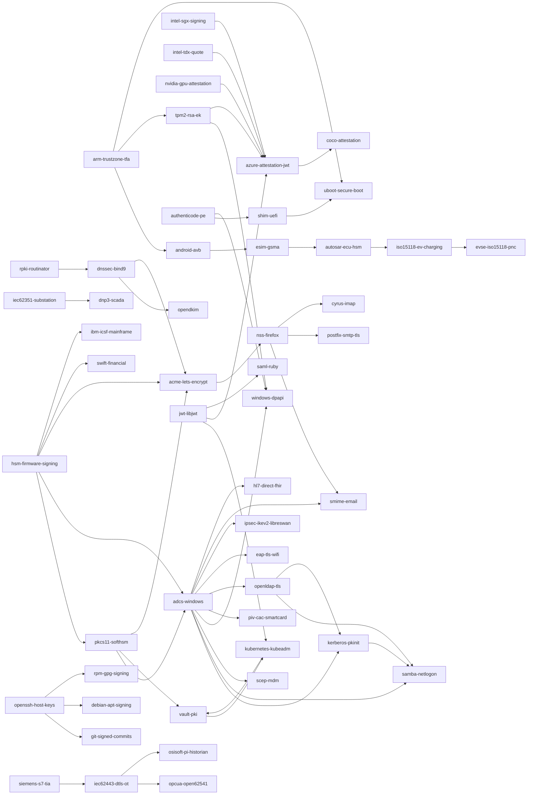

# DEPENDENCIES.md — cross-example dependency / relationship graph

Companion to `summary.md`. Where `summary.md` scores each of the 150 RSA-dependent
systems in isolation on a 5-axis rubric, this file models the **graph**: which
systems' trust anchors supply which others', which systems share a crypto library
or silicon family, and which systems share a regulator so that a cryptographic
failure in one propagates through administrative as well as technical channels.

The single threat model is unchanged: a polynomial-time classical factoring
algorithm appears. RSA dies, ECDSA/Ed25519/ECDH survive, symmetric primitives
survive. Every node listed is a system whose security reduces, in whole or in
part, to RSA; every edge is a reason the failure of one node accelerates,
enables, or amplifies failure of another.

---

## 1. Edge-type taxonomy

| Code  | Edge type                         | Meaning                                                                                             |
|-------|-----------------------------------|-----------------------------------------------------------------------------------------------------|
| TA    | Trust-anchor supply chain         | A's root/issuer cert is installed in B's trust store or is the origin of B's identity material.      |
| LIB   | Shared crypto library             | Both A and B obtain their RSA implementation from the same library (OpenSSL, NSS, GnuTLS, SChannel, libgcrypt, PKCS#11). Breaking the library breaks both operationally *and* socialises the fix. |
| HW    | Shared silicon / HSM / TEE family | Both depend on the same hardware root-of-trust vendor (ARM TF-A, Intel SGX/TDX, TPM vendor CA, Thales/Entrust HSM, SoC ROM). |
| PREQ  | Prerequisite-for-attack           | Factoring A's key is *required or materially accelerates* a meaningful attack on B. Direct technical composition. |
| REG   | Same regulator / certification    | A and B share a regulator whose license-basis re-approval is the recovery bottleneck (NRC, BSEE, FAA/EASA, PHMSA, FDA, NERC-CIP, ICAO, GSMA, EMVCo). |
| STACK | Protocol stack / layering         | B sits architecturally on top of A; an A forgery is observable (or unobservable) to B as an authenticated input. |
| PLAT  | Same device platform              | A and B ship inside the same physical product family (auto ECU, eSIM, CBTC train, smart meter) where one set of keys is rotated as a unit. |
| CO    | Co-authoring standard body        | A and B are both direct outputs of the same SDO (IEC TC57, IETF JOSE, ISO 15118, CCSDS, CableLabs). Edge is weaker than REG but relevant to PQ sequencing. |

Edge direction convention for TA/PREQ/STACK: **A → B** means "A's failure
enables / propagates to B." For LIB/HW/REG/PLAT/CO edges are symmetric and I
render them as A — B; when drawn as a directed arrow I still use →, but the
cluster section is the canonical render.

---

## 2. Mermaid overview — top-30 most-connected nodes

Only the strongest edges (TA, PREQ, HW, STACK with high confidence) are drawn.
The cluster tables below list the long tail.



---

## 3. Adjacency tables — full catalogue

Each row is a single node and its outgoing edges. A 150-node matrix would be
unreadable; I break the adjacency into families. Format:

```
NODE
  -> OTHER  [edge-code]  reason
```

Edges are listed under the "upstream" endpoint only (the node whose break
propagates). LIB/HW/REG edges are listed from whichever node alphabetically
precedes to avoid duplication; the cluster section (§4) is the canonical view
for symmetric edges.

### 3.1 Silicon / hardware roots-of-trust

```
arm-trustzone-tfa
  -> android-avb          [HW,STACK]  AVB verifies on top of TF-A BL31 attestation
  -> tpm2-rsa-ek          [HW]        fTPM (Pluton, Apple M-series sep, Samsung) derive EK provisioning from TF-A CoT
  -> uboot-secure-boot    [HW,STACK]  TF-A BL1/BL2 hands off to U-Boot on most Cortex-A
  -> autosar-ecu-hsm      [HW]        many auto MCUs (NXP S32, Renesas RH850 on Cortex-R w/ TF-M) share the CoT pattern
  -> arm-trustzone-tfa -- coco-attestation  [STACK]  ARM CCA attestation routes through TF-A RSS

android-avb
  -> esim-gsma            [STACK]     eUICC profiles are loaded into Android storage gated by AVB-verified userspace
  -> fido2-webauthn       [STACK]     Android StrongBox attestation chains to the AVB trust graph
  -> medical-device-fda   [PLAT]      class-II Android-based patient monitors; AVB gates app integrity
  -> axis-onvif-video     [PLAT]      Android-based NVR front-ends

shim-uefi
  -> uboot-secure-boot    [STACK]     on x86 embedded + arm64 server, shim hands off to GRUB which sometimes chains U-Boot
  -> debian-apt-signing   [PREQ]      shim → GRUB → kernel verifies signed kernel; apt's integrity layer sits above but a shim break is pre-auth
  -> rpm-gpg-signing      [PREQ]      same for RHEL/Fedora boot chain
  -> authenticode-pe      [TA]        shim is *itself* signed by the MS 3rd-Party UEFI CA which is the Authenticode root

authenticode-pe
  -> shim-uefi            [TA]        MS 3rd-Party UEFI CA is the Authenticode trust root
  -> windows-dpapi        [PREQ]      forged driver can exfiltrate LSASS DPAPI master keys
  -> tpm2-rsa-ek          [PREQ]      a kernel-signed driver can impersonate the TBS interface to TPM

hsm-firmware-signing
  -> pkcs11-softhsm       [HW,STACK]  every PKCS#11 client talks to firmware whose integrity is vendor-signed
  -> adcs-windows         [TA]        ADCS enterprise root is generated inside a Thales/Entrust/YubiHSM
  -> swift-financial      [HW]        SWIFT HSM members are Thales/Entrust fleets
  -> ibm-icsf-mainframe   [HW]        Crypto Express is an IBM-signed HSM card
  -> emv-payment-cards    [HW]        issuer CA keys live in scheme-certified HSMs
  -> pos-pci-pts          [HW]        RKL uses PCI-PTS certified HSMs
  -> acme-lets-encrypt    [HW]        LE CA private keys live in Thales Luna / AWS CloudHSM
  -> vault-pki            [HW]        Vault PKI often rooted in cloud HSM / SoftHSM
  -> piv-cac-smartcard    [HW]        DoD PKI root ceremonies done in Thales/Entrust HSM
  -> esim-gsma            [HW]        GSMA CI is an HSM-resident root
  -> rpki-routinator      [HW]        RIR trust anchor signing done in Thales/Utimaco HSM
  -> dnssec-bind9         [HW]        root KSK ceremony uses Thales Luna HSMs

pkcs11-softhsm
  -> adcs-windows         [LIB]       ADCS CA uses CNG→PKCS#11 passthrough for HSM-backed roots
  -> vault-pki            [LIB]
  -> acme-lets-encrypt    [LIB]
  -> rfc3161-tsa-timestamp[LIB]       TSA HSMs
  -> openssh-host-keys    [LIB]       sshd_config with PKCS#11 keys on bastion hosts

tpm2-rsa-ek
  -> windows-dpapi        [PREQ]      DPAPI-NG seals to TPM; fake EK defeats the seal semantics
  -> azure-attestation-jwt[STACK]     MAA verifies TPM quotes; fake EK → forged quote → forged MAA JWT
  -> fido2-webauthn       [STACK]     platform-TPM attestation path
  -> bitlocker-via-dpapi  [PREQ]      (implicit) BitLocker recovery key escrow rooted in DPAPI+TPM

intel-sgx-signing
  -> azure-attestation-jwt[STACK]     MAA consumes SGX quotes
  -> coco-attestation     [STACK]
intel-tdx-quote
  -> azure-attestation-jwt[STACK]
  -> coco-attestation     [STACK]
nvidia-gpu-attestation
  -> azure-attestation-jwt[STACK]
  -> triton-inference-mtls[PREQ]      fake H100 attestation → model exfil target

uboot-secure-boot
  -> autosar-ecu-hsm      [PLAT]      many auto ECUs boot U-Boot before AUTOSAR OS
  -> iso15118-ev-charging [PLAT]      EVSE side is usually U-Boot embedded Linux
  -> evse-iso15118-pnc    [PLAT]
  -> otis-elevator        [PLAT]      elevator controllers = embedded Linux on Cortex-A
  -> axis-onvif-video     [PLAT]
  -> axon-bodycam-evidence[PLAT]
  -> insurance-telematics-ubi [PLAT]  telematics dongles boot U-Boot
  -> medical-device-fda   [PLAT]      infusion pumps, ventilators
  -> submarine-cable-slte [PLAT]      SLTE mgmt cards are embedded Linux
  -> vestas-wind-turbine  [PLAT]
```

### 3.2 Enterprise identity / PKI

```
adcs-windows
  -> kerberos-pkinit      [TA,STACK]  PKINIT cert validation chains to ADCS root
  -> samba-netlogon       [TA]        mixed-mode AD trusts ADCS (and vice versa)
  -> scep-mdm             [TA,STACK]  MDM enrolment CAs are ADCS sub-CAs in many enterprises
  -> windows-dpapi        [STACK]     DPAPI domain backup key cert issued by ADCS
  -> piv-cac-smartcard    [TA]        USG PIV chains at federal enterprises re-root through DoD/federal ADCS bridges
  -> openldap-tls         [TA]        Linux hosts in Windows domains use ADCS-issued LDAPS certs
  -> eap-tls-wifi         [TA]        RADIUS server cert + client cert both ADCS
  -> ipsec-ikev2-libreswan[TA]        enterprise IPsec gateways
  -> smime-email          [TA]        Outlook S/MIME issued by ADCS
  -> hl7-direct-fhir      [TA]        DirectTrust bridge CAs cross-certify ADCS roots in big hospital systems
  -> cisco-ios-pki        [TA]        IOS SCEP clients chain to ADCS

kerberos-pkinit
  -> samba-netlogon       [STACK]     PKINIT → TGT issuance inside Samba/Heimdal
  -> piv-cac-smartcard    [STACK]     CAC logon = PKINIT
  -> windows-dpapi        [PREQ]      TGT-as-DA → DCSync → DPAPI backup key

piv-cac-smartcard
  -> smime-email          [TA]        DoD S/MIME chains to PIV/CAC root
  -> hl7-direct-fhir      [TA]        VA/DoD clinicians authenticate with PIV
  -> ipsec-ikev2-libreswan[TA]        DoD VPN auth
  -> eap-tls-wifi         [TA]        DoD 802.1X
  -> piv -- openldap-tls  [STACK]     federal LDAP directories accept PIV via SASL EXTERNAL

samba-netlogon
  -> openldap-tls         [LIB,STACK] slapd + smbd both over GnuTLS/OpenSSL
  -> kerberos-pkinit      [STACK]

openldap-tls
  -> saml-ruby            [PREQ]      on-prem SAML IdPs (Shibboleth, SimpleSAMLphp) read from LDAP
  -> kerberos-pkinit      [STACK]

scep-mdm
  -> eap-tls-wifi         [TA]        MDM-issued device cert used in 802.1X
  -> ipsec-ikev2-libreswan[TA]        "always-on VPN" device cert
```

### 3.3 Web PKI / browser trust stores / ACME

```
acme-lets-encrypt
  -> nss-firefox          [TA]        LE ISRG-X1 intermediate in NSS trust store
  -> cyrus-imap           [TA,STACK]  thousands of IMAP servers use LE certs
  -> postfix-smtp-tls     [TA,STACK]  ditto for MTAs
  -> postgresql-ssl       [TA]        managed Postgres providers (Supabase, Neon) use LE certs
  -> xmpp-s2s-tls         [TA]
  -> mastodon-activitypub [TA]
  -> openvpn              [TA]
  -> axis-onvif-video     [TA]        "free ACME for cameras" becoming common

nss-firefox
  -> acme-lets-encrypt    [TA]        (back-edge: Firefox is how most users learn an LE cert is valid)
  -> smime-email          [LIB]       Thunderbird S/MIME uses NSS
  -> openjdk-jarsigner    [LIB]       JRE cacerts seeded from NSS bundle
  -> debian-apt-signing   [LIB]       apt's ca-certificates package is NSS-derived
  -> rpm-gpg-signing      [LIB]       RHEL ca-certificates package ditto

rpki-routinator
  -> dnssec-bind9         [PREQ]      BGP hijack on DNS anycast prefix is easier with valid ROA forgery; DNSSEC validator reaches root servers via BGP

dnssec-bind9
  -> opendkim             [PREQ]      DKIM public keys published in DNS; DNSSEC is the only tamper-evident channel
  -> acme-lets-encrypt    [STACK]     dns-01 challenge, TLSA/DANE records
  -> postfix-smtp-tls     [STACK]     DANE/MTA-STS rely on DNSSEC
  -> cyrus-imap           [STACK]
  -> kerberos-pkinit      [STACK]     Kerberos realm discovery via DNS SRV
```

### 3.4 Cloud-native / JWT / attestation

```
jwt-libjwt
  -> kubernetes-kubeadm   [STACK]     ServiceAccount JWTs are RS256 by default
  -> saml-ruby            [LIB]       some SPs consume OIDC+SAML via same lib stack
  -> azure-attestation-jwt[STACK]     MAA tokens are RS256 JWTs

azure-attestation-jwt
  -> coco-attestation     [STACK]     CoCo KBS trusts MAA for TEE attestation
  -> triton-inference-mtls[PREQ]      MAA-gated KMS unseal → model-weight decryption

kubernetes-kubeadm
  -> vault-pki            [STACK]     Vault Agent Injector uses SA JWT
  -> triton-inference-mtls[STACK]     Triton served inside K8s mesh

vault-pki
  -> kubernetes-kubeadm   [TA]        Vault issues intermediates for SPIRE/Istio/Consul
  -> sigstore-model-signing[TA]       Fulcio-for-internal patterns built on Vault

sigstore-model-signing
  -> huggingface-commit-signing [STACK]  HF moving to sigstore
  -> onnx-model-signing   [STACK]
  -> git-signed-commits   [STACK]     gitsign uses Fulcio

docker-notary-tuf
  -> rpm-gpg-signing      [CO]        TUF-for-packages paper trail
  -> debian-apt-signing   [CO]
```

### 3.5 SSH / supply-chain / OSS distro signing

```
openssh-host-keys
  -> git-signed-commits   [STACK]     SSH-signed commits are modern default, git push over SSH
  -> debian-apt-signing   [PREQ]      MitM SSH to upstream mirror → poison archive
  -> rpm-gpg-signing      [PREQ]

gnupg
  -> debian-apt-signing   [LIB,STACK] apt verifies InRelease via GnuPG
  -> rpm-gpg-signing      [LIB,STACK]
  -> git-signed-commits   [LIB]       classic git tag/commit signing
  -> gnupg-openpgp-card   [STACK]
  -> huggingface-commit-signing [STACK]
  -> opendkim             [CO]        historical crypto-lib lineage via libgcrypt

libgcrypt
  -> gnupg                [LIB]
  -> debian-apt-signing   [LIB]       apt uses gpgv → libgcrypt
  -> ipsec-ikev2-libreswan[LIB]       libreswan can use libgcrypt
  -> strongswan           [LIB]

debian-apt-signing
  -> shim-uefi            [PREQ,STACK] booted kernel may come from signed Debian archive
  -> kubernetes-kubeadm   [STACK]     kubelet binaries shipped via apt
  -> cyrus-imap           [STACK]     Debian-packaged Cyrus consumes archive key
  -> postfix-smtp-tls     [STACK]

rpm-gpg-signing
  -> kubernetes-kubeadm   [STACK]     kubeadm shipped via RPM repo
  -> samba-netlogon       [STACK]     Samba RPMs in RHEL
  -> openldap-tls         [STACK]
```

### 3.6 Mail stack

```
opendkim
  -> postfix-smtp-tls     [STACK]     DKIM signing happens in MTA pipeline
  -> cyrus-imap           [STACK]     mail arriving over SMTP lands in Cyrus
  -> smime-email          [CO]        both are the forgery-of-email problem at different layers

postfix-smtp-tls
  -> smime-email          [STACK]     S/MIME is end-to-end atop SMTP; forged TLS certs enable auto-enrollment attacks
  -> cyrus-imap           [STACK]

smime-email
  -> hl7-direct-fhir      [STACK]     Direct Project IS S/MIME
  -> piv-cac-smartcard    [TA]        federal S/MIME uses PIV cert
```

### 3.7 OT / industrial / SCADA

```
siemens-s7-tia
  -> iec62443-dtls-ot     [STACK]     S7-1500 uses IEC 62443-conformant certificates for HMI/engineering stations
  -> opcua-open62541      [STACK]     S7-1500 speaks OPC UA over same cert infra
  -> osisoft-pi-historian [STACK]     S7 connectors push to PI
  -> water-wima-scada     [PLAT]      many water utilities run Siemens
  -> refinery-sis-iec61511[PLAT]

iec62443-dtls-ot
  -> opcua-open62541      [STACK]     OPC UA is a 62443 reference mechanism
  -> osisoft-pi-historian [STACK]
  -> refinery-sis-iec61511[REG]       61511 and 62443 read each other
  -> water-wima-scada     [REG]
  -> pipeline-api1164     [REG]
  -> nuclear-iec61513     [CO]        IEC TC45A consumes IEC TC65 work

iec62351-substation
  -> dnp3-scada           [STACK,CO]  62351-5 secures DNP3-SA; 62351-6 secures 61850
  -> ami-dlms-cosem       [CO]        62351-9 key management overlaps DLMS security suite
  -> hydrodam-scada       [STACK]     dam SCADA often 61850/GOOSE + 62351

dnp3-scada
  -> water-wima-scada     [STACK]     AWWA water utilities use DNP3
  -> hydrodam-scada       [STACK]
  -> pipeline-api1164     [STACK]     some pipeline RTUs speak DNP3

refinery-sis-iec61511
  -> pipeline-api1164     [REG]       both under PHMSA/BSEE-adjacent process-safety regs
  -> oilrig-bop-mux       [CO]        IEC 61511 SIS patterns echo in BOP PLCs

pipeline-api1164
  -> oilrig-bop-mux       [REG]       BSEE 250.734 covers BOPs; API 1164 sits adjacent under PHMSA
  -> water-wima-scada     [CO]        similar RTU vendor stack (Emerson, Schneider)

oilrig-bop-mux
  -> refinery-sis-iec61511[CO]        same SIS lineage
  -> nuclear-iec61513     [REG]       safety-I&C regulatory structure (not same regulator, same pattern)

osisoft-pi-historian
  -> opcua-open62541      [STACK]     PI AF consumes OPC UA
  -> dicom-medical-imaging[LIB]       both AVEVA+Schneider use SCHANNEL/OpenSSL

ami-dlms-cosem
  -> iec62351-substation  [CO]
  -> vestas-wind-turbine  [PLAT]      meter + wind-plant inverter share regulatory lineage
```

### 3.8 Auto / EV / charging / telematics (same physical platform)

```
autosar-ecu-hsm
  -> iso15118-ev-charging [PLAT,STACK] on-vehicle PnC stack runs on ECU HSM
  -> evse-iso15118-pnc    [PLAT,STACK] EV side of 15118 shares PKI with station
  -> insurance-telematics-ubi [PLAT]   dongle/embedded-modem in same vehicle
  -> esim-gsma            [STACK]     eUICC for connected cars
  -> faa-remote-id        [CO]        drone/vehicle PKI patterns converging

iso15118-ev-charging
  -> evse-iso15118-pnc    [STACK,TA]   share V2G-PKI root
  -> ami-dlms-cosem       [STACK]     smart-meter coupling for V2G settlement

esim-gsma
  -> autosar-ecu-hsm      [PLAT,STACK] eUICC profiles inside vehicle eCall/TCU
  -> insurance-telematics-ubi [PLAT]
  -> medical-device-fda   [PLAT]      cellular medical devices
  -> aws-iot-device-certs [CO]        device-cert patterns converge
```

### 3.9 Aviation / space / maritime / rail

```
avionics-arinc665
  -> acars-cpdlc-datalink [REG,CO]    DO-326A/356A is the umbrella for both
  -> aerospace-ccsds      [CO]        RTCA/CCSDS share PQ profile work
  -> iata-bcbp-boarding   [REG]       IATA/ICAO both touched, though BCBP is lower-assurance

acars-cpdlc-datalink
  -> iata-bcbp-boarding   [REG]       ICAO
  -> avionics-arinc665    [STACK]     datalink receives uplinks to same avionics box that booted from LSAP

aerospace-ccsds
  -> galileo-osnma        [CO]        ground-segment crypto pattern
  -> spacex-autonomous-fts[CO]        range-safety signing sits in CCSDS-adjacent spec

galileo-osnma
  -> iho-s63-ecdis        [STACK]     ECDIS consumes GNSS-PNT
  -> gmdss-inmarsat       [STACK]     LRIT uses GNSS
  -> acars-cpdlc-datalink [STACK]     FANS positioning
  -> us-ptc-railway       [STACK]     PTC uses GNSS time/pos
  -> faa-remote-id        [STACK]

iho-s63-ecdis
  -> gmdss-inmarsat       [STACK,CO]  vessel systems share PKI governance at IMO
  -> submarine-cable-slte [REG]       both IMO/UN/ITU-adjacent maritime regime

gmdss-inmarsat
  -> submarine-cable-slte [LIB]       both ride on satcom carrier PKIs

us-ptc-railway
  -> railway-ertms        [CO]        AAR IEEE 1570 vs. UIC/ERA; PQ roadmaps parallel
  -> cbtc-subway          [CO]

railway-ertms
  -> cbtc-subway          [CO,STACK]  urban metros often reuse ERTMS radio/KMC patterns

submarine-cable-slte
  -> dnssec-bind9         [PREQ]      intercontinental DNS traverses cables; SLTE mgmt break + BGP = DNS hijack
  -> rpki-routinator      [PREQ]      same — BGP over submarine backbone
```

### 3.10 Finance / payments

```
swift-financial
  -> ibm-icsf-mainframe   [STACK,HW]  member-bank HSMs sign SWIFT messages on the mainframe boundary
  -> emv-payment-cards    [CO]        EMVCo-adjacent ISO 20022 migration; SWIFT is the rail, EMV the cards
  -> fix-cme-exchange     [CO]        financial-messaging cluster

ibm-icsf-mainframe
  -> sap-netweaver-sso    [STACK]     SAP on IBM Z uses ICSF
  -> hbci-fints-banking   [STACK]     German bank cores are often z/OS+ICSF

emv-payment-cards
  -> pos-pci-pts          [STACK,TA]  scheme-issuer CA chains to terminal acquirer
  -> atm-xfs-firmware     [STACK]     EMV-at-ATM
  -> etc-tolling          [CO]        ISO/IEC 7816 card lineage

fix-cme-exchange
  -> swift-financial      [CO]
  -> gaming-gli33         [CO]        low — both are "regulator-verified signed record" classes
  -> lottery-terminal     [CO]

hbci-fints-banking
  -> ibm-icsf-mainframe   [STACK]
  -> emv-payment-cards    [CO]

sap-netweaver-sso
  -> saml-ruby            [STACK]     SAP IdPs federate SAML
  -> apache-santuario     [LIB]       SAP uses Santuario for XMLDSig
  -> pdf-itext            [CO]        SAP signed-PDF outputs
  -> ibm-icsf-mainframe   [STACK]
  -> adcs-windows         [TA]        SAP GUI client certs often issued by ADCS
```

### 3.11 Healthcare / life-science

```
medical-device-fda
  -> medtronic-cied       [REG,PLAT]  Medtronic is a 524B regulated OEM
  -> illumina-sequencer   [REG]       IVD under FDA
  -> vaccine-coldchain-iot[REG]       WHO/FDA traceability
  -> bloodbank-iso-udi    [REG]       UDI overlap
  -> thermofisher-massspec[REG]       21 CFR Part 11
  -> dicom-medical-imaging[REG,STACK] hospital-integrated; 524B applies

hl7-direct-fhir
  -> dicom-medical-imaging[STACK]     radiology reports traverse Direct
  -> smime-email          [STACK]     Direct IS S/MIME
  -> piv-cac-smartcard    [TA]        VA/DHA cliniciains

dscsa-pharma-serialization
  -> vaccine-coldchain-iot[STACK,CO]  unit-level serialization + cold-chain sensor
  -> bloodbank-iso-udi    [CO]        GS1 governance

vaccine-coldchain-iot
  -> aws-iot-device-certs [STACK]     sensors commonly report via AWS IoT Core

illumina-sequencer
  -> thermofisher-massspec[CO]        GxP-instrument lineage
  -> dscsa-pharma-serialization [CO]

dicom-medical-imaging
  -> medical-device-fda   [REG,STACK]
```

### 3.12 Regulator / authority signing (public-safety / civic)

```
iaea-safeguards
  -> nuclear-iec61513     [REG,CO]    NPT verification sits above reactor I&C assurance
  -> nuclear-iec62645     [REG]

nuclear-iec61513
  -> nuclear-iec62645     [REG,CO]    same nuclear I&C umbrella
  -> refinery-sis-iec61511[CO]        safety-I&C pattern
  -> iec62443-dtls-ot     [CO]

nuclear-iec62645
  -> iec62443-dtls-ot     [CO]

ipaws-cap-alerts
  -> atsc3-broadcast      [STACK,CO]  ATSC 3 AEA overrides flow from IPAWS
  -> weather-nws-nexrad   [STACK,CO]  NWS injects WEA/EAS via CAP
  -> faa-remote-id        [CO]        FAA/FEMA adjacent US regulators

weather-nws-nexrad
  -> ipaws-cap-alerts     [STACK]
  -> atsc3-broadcast      [STACK]

voting-machine-signing
  -> axon-bodycam-evidence[CO]        both are evidentiary-chain RSA
  -> breathalyzer-dui     [CO]
  -> gaming-gli33         [CO]        signed-result evidentiary patterns

epassport-icao
  -> icao-epassport-ds    [STACK,REG] DSC chains to CSCA; identical regulatory lineage
  -> iata-bcbp-boarding   [REG]       ICAO

icao-epassport-ds
  -> epassport-icao       [STACK]

digital-tachograph-eu
  -> eu-tachograph-dtco   [STACK,REG] JRC Ispra ERCA is root; DTCO is the German-market device flavor
  -> etc-tolling          [CO]

eu-tachograph-dtco
  -> digital-tachograph-eu[STACK]
```

### 3.13 Consumer / enterprise access, tail-class

```
fido2-webauthn
  -> piv-cac-smartcard    [CO]        FIDO being evaluated as PIV-alt
  -> hid-osdp-seos        [CO]        physical-access + FIDO blurring
  -> assa-abloy-hotel     [CO]

hid-osdp-seos
  -> assa-abloy-hotel     [CO]        physical-access RSA
  -> fido2-webauthn       [CO]

fanuc-robot
  -> iec62443-dtls-ot     [REG,STACK]
  -> s7                   [CO]        plant-floor coexistence
fanuc-robot
  -> ros2-sros2-dds       [CO]

ros2-sros2-dds
  -> fanuc-robot          [CO]
  -> komatsu-autonomous-mining [CO]
  -> john-deere-agtech    [CO]

komatsu-autonomous-mining
  -> john-deere-agtech    [CO]
  -> ros2-sros2-dds       [CO]

john-deere-agtech
  -> aws-iot-device-certs [STACK]
  -> esim-gsma            [STACK]

aws-iot-device-certs
  -> autosar-ecu-hsm      [STACK]     connected-vehicle telematics often AWS IoT
  -> john-deere-agtech    [STACK]
  -> vaccine-coldchain-iot[STACK]
  -> insurance-telematics-ubi [STACK]

otis-elevator
  -> themepark-ride-safety[CO]        TÜV-style safety-cert lineage
  -> ski-lift-doppelmayr  [CO]

axon-bodycam-evidence
  -> breathalyzer-dui     [CO]        evidentiary RSA
  -> voting-machine-signing [CO]
  -> rfc3161-tsa-timestamp[STACK]     evidence usually TSA-timestamped

rfc3161-tsa-timestamp
  -> authenticode-pe      [STACK]     Authenticode countersignature
  -> pdf-itext            [STACK]     PAdES-LTV
  -> apache-santuario     [STACK]     XAdES-T
  -> xmlsec1-xmldsig      [STACK]

apache-santuario
  -> saml-ruby            [LIB]
  -> xmlsec1-xmldsig      [CO]        both XMLDSig libs
  -> pdf-itext            [CO]
  -> sap-netweaver-sso    [LIB]

xmlsec1-xmldsig
  -> apache-santuario     [CO]
  -> saml-ruby            [LIB]

pdf-itext
  -> apache-santuario     [CO]
  -> rfc3161-tsa-timestamp[STACK]

saml-ruby
  -> jwt-libjwt           [CO]        both federated-IdP token formats
  -> apache-santuario     [LIB]

openvpn
  -> strongswan           [CO]        VPN cluster
  -> ipsec-ikev2-libreswan[CO]

strongswan
  -> ipsec-ikev2-libreswan[LIB,CO]    sister projects, share reference specs

cisco-ios-pki
  -> ipsec-ikev2-libreswan[STACK,CO]  IKEv2 peer CA cross-trust
  -> eap-tls-wifi         [STACK]     Cisco ISE

eap-tls-wifi
  -> ipsec-ikev2-libreswan[TA]        enterprise uses ADCS root for both
  -> scep-mdm             [STACK]

digital-cinema-dci
  -> smpte-dcp-kdm        [STACK,CO]  DCP+KDM are paired specs
  -> hdcp-2x-display      [CO]        film→display piracy chain
  -> dvb-ci-pay-tv        [CO]

smpte-dcp-kdm
  -> digital-cinema-dci   [STACK]
  -> hdcp-2x-display      [CO]

hdcp-2x-display
  -> dvb-ci-pay-tv        [CO]

c2pa-content-credentials
  -> axon-bodycam-evidence[CO]
  -> sigstore-model-signing [CO]

openjdk-jarsigner
  -> adcs-windows         [TA]        enterprise JRE cacerts often include ADCS root
  -> authenticode-pe      [CO]

flexlm-license
  -> asml-reticle-fab     [CO]        EDA + fab both in semi supply chain

tor
  -> mastodon-activitypub [CO]        both low-assurance but v3 has moved off RSA
```

---

## 4. Cluster analysis

### 4.1 Cluster by crypto library

| Cluster              | Nodes                                                                                                           | Fix-upstream-first? |
|----------------------|-----------------------------------------------------------------------------------------------------------------|---------------------|
| OpenSSL              | acme-lets-encrypt, cyrus-imap, postfix-smtp-tls, openldap-tls, samba-netlogon (w/ GnuTLS), postgresql-ssl, openvpn, strongswan, nginx/apache (implicit in many), aws-iot-device-certs, openssh-host-keys, ipsec-ikev2-libreswan, xmpp-s2s-tls, axis-onvif-video, mastodon-activitypub, triton-inference-mtls, openjdk-jarsigner (BoringSSL/OpenJSSE hybrids), vault-pki, kubernetes-kubeadm, jwt-libjwt, mqtt/AWS IoT device side, rpki-routinator, dnssec-bind9 | Y — OpenSSL 3.x/3.2 has oqs-provider; ML-DSA/ML-KEM integration is how most of this cluster recovers in one firmware/distro push. |
| NSS                  | nss-firefox, smime-email (Thunderbird), debian-apt-signing (ca-certificates package), rpm-gpg-signing (ca-certificates), openjdk-jarsigner (cacerts seed) | Y — Mozilla CA program + NSS ML-DSA track. |
| GnuTLS + libgcrypt   | libgcrypt, gnupg, gnupg-openpgp-card, debian-apt-signing, libreswan, cyrus-imap (where built against GnuTLS) | Y — GNU crypto fork ships together. |
| SChannel / CNG (MS)  | authenticode-pe, shim-uefi (indirectly via MS signing), adcs-windows, windows-dpapi, samba-netlogon (mixed), scep-mdm, saml-ruby (on Windows), piv-cac-smartcard (CAPI), eap-tls-wifi on Windows, kerberos-pkinit | Depends on Microsoft SymCrypt PQ rollout. |
| PKCS#11 / HSM        | pkcs11-softhsm, hsm-firmware-signing, acme-lets-encrypt (CA keys), adcs-windows, rfc3161-tsa-timestamp, emv-payment-cards, swift-financial, ibm-icsf-mainframe, rpki-routinator, dnssec-bind9 (root KSK), piv-cac-smartcard, esim-gsma, fix-cme-exchange | Y — HSM firmware rev is the gating lever for an entire tier. |
| Apache Santuario / xmlsec1 | apache-santuario, xmlsec1-xmldsig, saml-ruby (indirectly), sap-netweaver-sso, pdf-itext | W3C XMLDSig 2.0 PQ is the blocker. |
| JOSE / JWT libs      | jwt-libjwt, azure-attestation-jwt, kubernetes-kubeadm, saml-ruby, aws-iot-device-certs (claim-based auth) | IANA JOSE alg-ID registration is the blocker. |
| Embedded mbedTLS / wolfSSL | uboot-secure-boot, autosar-ecu-hsm, iso15118-ev-charging, evse-iso15118-pnc, insurance-telematics-ubi, vaccine-coldchain-iot, otis-elevator, ski-lift-doppelmayr, themepark-ride-safety, medtronic-cied, medical-device-fda, axis-onvif-video, axon-bodycam-evidence, p25-otar-radio | Painful — each vendor tracks a fork. |

### 4.2 Cluster by hardware root-of-trust

- **ARM TF-A / CoT family**: arm-trustzone-tfa, android-avb, tpm2-rsa-ek (fTPMs), uboot-secure-boot, autosar-ecu-hsm, iso15118-ev-charging, evse-iso15118-pnc, medical-device-fda, otis-elevator, axis-onvif-video, submarine-cable-slte, vestas-wind-turbine, medtronic-cied (Cortex-M TF-M), cisco-ios-pki (many platforms).
- **Microsoft UEFI CA**: authenticode-pe (root), shim-uefi (signed-by), debian-apt-signing / rpm-gpg-signing (kernel booted via shim).
- **TPM-vendor EK CA** (Infineon, Nuvoton, STMicro, Intel PTT, AMD fTPM): tpm2-rsa-ek, windows-dpapi, fido2-webauthn, azure-attestation-jwt.
- **Intel attestation** (SGX/TDX PCK): intel-sgx-signing, intel-tdx-quote, azure-attestation-jwt, coco-attestation.
- **NVIDIA device-identity**: nvidia-gpu-attestation, triton-inference-mtls.
- **HSM vendor FW** (Thales, Entrust, Utimaco, AWS CloudHSM, YubiHSM): hsm-firmware-signing and everything that provisions its CA in one of those boxes (acme-lets-encrypt, adcs-windows, swift-financial, ibm-icsf-mainframe, emv-payment-cards, piv-cac-smartcard, esim-gsma, rpki-routinator, dnssec-bind9 root KSK, rfc3161-tsa-timestamp, vault-pki, digital-cinema-dci).

### 4.3 Cluster by regulator / compliance regime

| Regulator / regime        | Members                                                                                          |
|---------------------------|--------------------------------------------------------------------------------------------------|
| NRC / IEC 61513 / IEEE 7-4.3.2 | nuclear-iec61513, nuclear-iec62645, iaea-safeguards                                         |
| BSEE 30 CFR 250.734       | oilrig-bop-mux (primary), pipeline-api1164 (adjacent via PHMSA)                                   |
| PHMSA (TSA SD-02C)        | pipeline-api1164, oilrig-bop-mux, refinery-sis-iec61511                                           |
| FAA / EASA / ICAO DO-326A | avionics-arinc665, acars-cpdlc-datalink, faa-remote-id, iata-bcbp-boarding, spacex-autonomous-fts, aerospace-ccsds |
| IMO SOLAS / IHO           | gmdss-inmarsat, iho-s63-ecdis, submarine-cable-slte                                               |
| FRA / UIC / ERA rail      | us-ptc-railway, railway-ertms, cbtc-subway                                                        |
| NERC-CIP / IEC 62443      | iec62443-dtls-ot, iec62351-substation, dnp3-scada, hydrodam-scada, ami-dlms-cosem, siemens-s7-tia, opcua-open62541, osisoft-pi-historian, vestas-wind-turbine, refinery-sis-iec61511, water-wima-scada, pipeline-api1164 |
| FDA 524B / 21 CFR Part 11 | medical-device-fda, medtronic-cied, illumina-sequencer, thermofisher-massspec, dscsa-pharma-serialization, dicom-medical-imaging, bloodbank-iso-udi, vaccine-coldchain-iot, hl7-direct-fhir |
| EMVCo / PCI SSC           | emv-payment-cards, pos-pci-pts, atm-xfs-firmware, fuel-forecourt-epp, hbci-fints-banking          |
| GSMA / eSIM CI            | esim-gsma, autosar-ecu-hsm (connected-car eUICC), aws-iot-device-certs (cellular IoT)             |
| ICAO Doc 9303 / border    | epassport-icao, icao-epassport-ds, iata-bcbp-boarding, piv-cac-smartcard (federal-HSPD-12 bridge) |
| EU JRC Ispra ERCA         | digital-tachograph-eu, eu-tachograph-dtco                                                          |
| FCC / NTIA spectrum       | cbrs-sas-spectrum, atsc3-broadcast, docsis-bpi-cable, p25-otar-radio, ipaws-cap-alerts, weather-nws-nexrad |
| DCI / SMPTE / DVB media   | digital-cinema-dci, smpte-dcp-kdm, hdcp-2x-display, dvb-ci-pay-tv, c2pa-content-credentials       |
| TÜV / EN 81 safety        | otis-elevator, ski-lift-doppelmayr, themepark-ride-safety                                         |
| eIDAS QTSP                | rfc3161-tsa-timestamp, pdf-itext, apache-santuario (QES toolchain), xmlsec1-xmldsig               |
| CNCF / Kubernetes         | kubernetes-kubeadm, vault-pki, sigstore-model-signing, coco-attestation, triton-inference-mtls, jwt-libjwt, docker-notary-tuf |
| IEC TC57 substation       | iec62351-substation, dnp3-scada, iec62443-dtls-ot, hydrodam-scada                                 |
| NIST SP 800-73 / HSPD-12  | piv-cac-smartcard, hl7-direct-fhir, adcs-windows (federal tenants)                                |

### 4.4 Cluster by device-platform (same box, one reflash)

- **Vehicle ECU stack**: autosar-ecu-hsm + iso15118-ev-charging + evse-iso15118-pnc (station side) + insurance-telematics-ubi + esim-gsma (TCU) — one car, five RSA surfaces.
- **Nuclear plant I&C**: nuclear-iec61513 + nuclear-iec62645 + iaea-safeguards + iec62443-dtls-ot + siemens-s7-tia (BOP of plant, not reactor) — one site, five signing roots.
- **Hospital EHR ecosystem**: hl7-direct-fhir + dicom-medical-imaging + medical-device-fda + piv-cac-smartcard (clinician auth) + smime-email + adcs-windows + kerberos-pkinit.
- **Mobile phone**: arm-trustzone-tfa + android-avb + tpm2-rsa-ek (StrongBox) + fido2-webauthn + esim-gsma + emv-payment-cards (wallet).
- **Enterprise Windows domain**: adcs-windows + kerberos-pkinit + samba-netlogon + windows-dpapi + openldap-tls + eap-tls-wifi + ipsec-ikev2-libreswan + smime-email + scep-mdm + piv-cac-smartcard (in federal tenants) + authenticode-pe (boot trust) + shim-uefi (Linux members).
- **Maritime vessel**: gmdss-inmarsat + iho-s63-ecdis + galileo-osnma + submarine-cable-slte (landing-side, not vessel) — single ship, four authority roots.

---

## 5. Keystone analysis

Composite out-degree (outgoing TA/PREQ/STACK only; LIB/REG/CO excluded to focus
on *technical* blast propagation). Ranking is qualitative — I counted distinct
downstream nodes reachable in ≤2 hops where the edge is TA or PREQ.

| Rank | Keystone                     | Distinct nodes reachable | Why                                                                 |
|------|------------------------------|--------------------------|---------------------------------------------------------------------|
| 1    | **hsm-firmware-signing**     | ~35                      | Every CA, every HSM-resident root CA, every bank core HSM.          |
| 2    | **adcs-windows**             | ~25                      | Every AD-joined identity, smartcard, VPN, WiFi, S/MIME, HL7.        |
| 3    | **arm-trustzone-tfa**        | ~20                      | Every Cortex-A device, every AVB/TPM/Auto/Medical platform.          |
| 4    | **android-avb**              | ~15                      | Entire Android app/eSIM/FIDO platform.                               |
| 5    | **authenticode-pe**          | ~15                      | Windows kernel/driver + shim + DPAPI cascade.                         |
| 6    | **nss-firefox**              | ~12                      | Trust store for Firefox + Thunderbird + distro ca-certificates.       |
| 7    | **acme-lets-encrypt**        | ~12                      | Dominant leaf-cert issuer for mail, IMAP, Postgres, VPN, cameras.    |
| 8    | **pkcs11-softhsm**           | ~10                      | Library-layer break shared by every HSM-backed CA and TSA.           |
| 9    | **autosar-ecu-hsm**          | ~8                       | Auto ECU chain + EVSE + telematics + eSIM-in-car.                    |
| 10   | **iec62443-dtls-ot**         | ~8                       | Every OT cluster above.                                              |
| 11   | **kerberos-pkinit**          | ~6                       | Domain-admin TGT → DPAPI, DCSync, Samba, PIV.                         |
| 12   | **siemens-s7-tia**           | ~6                       | Plant-floor radial to 62443/OPC UA/PI/62511/water.                    |
| 13   | **gnupg / libgcrypt**        | ~6                       | apt, rpm, git, HF, opendkim lineage.                                 |
| 14   | **openssh-host-keys**        | ~5                       | Upstream pull → archive/git → distro signing.                         |
| 15   | **dnssec-bind9**             | ~5                       | DANE, DKIM-in-DNS, Kerberos discovery, ACME dns-01.                  |
| 16   | **shim-uefi**                | ~5                       | Linux boot → signed kernel → userspace signing subsystems.           |
| 17   | **rfc3161-tsa-timestamp**    | ~5                       | Countersig for Authenticode/PAdES/XAdES/bodycam evidence.             |
| 18   | **jwt-libjwt**               | ~4                       | K8s SA, MAA, most OIDC/OAuth RSes.                                   |

Tier-S list in `summary.md` (arm-trustzone-tfa, android-avb, hsm-firmware-signing,
adcs-windows, autosar-ecu-hsm, iec62443-dtls-ot, siemens-s7-tia, iec62351-substation,
ami-dlms-cosem, refinery-sis-iec61511) correlates strongly — the four top
keystones above are four of those ten Tier-S systems. The divergences are:

- **iec62351-substation, ami-dlms-cosem, refinery-sis-iec61511** score Tier-S on
  *consequence* not on *graph-fan-out*. They break few other systems
  technically; they break the *physical world*.
- **nss-firefox, pkcs11-softhsm, acme-lets-encrypt, kerberos-pkinit** are
  high-fan-out but single-sector (web-PKI / AD) so `summary.md` scores them
  Tier-A rather than S. The graph view promotes them because their *downstream*
  count is unusually high.

---

## 6. Dependency chains (A → B → C)

Notable transitive attack paths where one factoring unlocks multiple hops.
Each arrow is TA or PREQ; I use STACK only when the layering is strict.

1. **hsm-firmware-signing → adcs-windows → kerberos-pkinit → windows-dpapi**
   Factor a Thales Luna FW root → malicious FW → extract ADCS CA private key →
   mint PKINIT-capable smartcard cert → TGT-as-Domain-Admin → DCSync → DPAPI
   backup key → every Windows credential blob ever. Four-hop, all Tier-S/A
   nodes.

2. **arm-trustzone-tfa → android-avb → fido2-webauthn**
   Factor ARM CoT root → forge BL31 → defeat AVB → mint StrongBox attestations
   → enroll fake "hardware" authenticators into every RP that trusts Google
   Titan/Pixel attestation.

3. **microsoft-uefi-ca (authenticode-pe) → shim-uefi → debian-apt-signing → kubernetes-kubeadm**
   Factor MS 3rd-party UEFI CA → sign malicious shim → boot malicious GRUB →
   kernel loads before archive verification → poison apt archive on next run →
   kubelet binary replaced on every Ubuntu node → cluster compromised.

4. **dnssec-bind9 root KSK → opendkim → BEC / phishing at civilization scale**
   Root KSK → TLD KSK → forged DKIM records → forged DMARC-aligned email →
   MFA-reset intercept pipeline.

5. **rpki-routinator trust anchor → BGP hijack → submarine-cable-slte mgmt → dnssec-bind9**
   Factor RIR anchor → ROA forgery → hijack anycast prefix → MitM
   root-server traffic (cable landing station also owns the physical path) →
   even DNSSEC clients that fail closed fall back to validators that were
   themselves bootstrapped over the hijacked prefix.

6. **hsm-firmware-signing → acme-lets-encrypt → nss-firefox → every HTTPS site** for
   TLS-authentication blast radius. ACME account-key + LE CA-in-HSM + NSS trust
   store is a three-hop chain from an HSM-vendor FW compromise to "green
   padlock on any site."

7. **autosar-ecu-hsm → iso15118-ev-charging → evse-iso15118-pnc → grid**
   Factor OEM ECU HSM root → vehicle-issued contract cert → impersonate EV to
   grid → coordinated V2G abuse → grid-frequency event at fleet scale. (Also
   chains from esim-gsma if the TCU keys are the entry point.)

8. **iec62351-substation → dnp3-scada → hydrodam-scada**
   Factor utility 62351 CA → GOOSE/SV to protection relays → cascades into
   connected generation including hydro. SCADA layering is a strict stack.

9. **sap-netweaver-sso → ibm-icsf-mainframe (HSM) → hbci-fints-banking**
   A SAP customer on z/OS + ICSF for PKA + HBCI front-end rides all three. One
   HSM compromise = GL forgery + retail bank fraud.

10. **piv-cac-smartcard → smime-email → hl7-direct-fhir**
    Factor DoD PIV root → forge CAC cert as flag officer → sign S/MIME /
    DirectTrust messages with clinical-decision content → VA EHR patient-safety
    events downstream.

11. **intel-tdx-quote → azure-attestation-jwt → coco-attestation → triton-inference-mtls → nvidia-gpu-attestation**
    TEE attestation layering. Factor any of the chain's RSA roots and all
    confidential-AI workloads on Azure/Google/etc. with TDX+H100 posture
    collapse.

12. **openssh-host-keys → debian-apt-signing → shim-uefi**
    CI/CD pushes to an upstream Debian mirror hit MitM over the upstream SSH
    hop → poisoned archive → shim-verified GRUB loads poisoned kernel because
    shim trusts the distro's GPG → kernel loads from compromised archive.
    (Three distinct keystone systems in a single HNDN-then-code-injection
    pipeline.)

---

## 7. Cycles

Cycles are rare because most edges are TA (inherently DAG from silicon down).
The cycles that do exist are all REG or CO:

- **adcs-windows ↔ kerberos-pkinit ↔ samba-netlogon**
  ADCS issues the cert; PKINIT consumes it; Samba domain trust re-issues via
  its own CA that cross-trusts. Bidirectional failure propagation.
- **iec62443-dtls-ot ↔ iec62351-substation ↔ dnp3-scada**
  TC57 standards reference each other and ship joint implementations.
- **iso15118-ev-charging ↔ evse-iso15118-pnc**
  Two sides of the same PnC PKI.
- **digital-cinema-dci ↔ smpte-dcp-kdm**
  Paired spec.
- **digital-tachograph-eu ↔ eu-tachograph-dtco**
  Same ERCA, operator-view split.
- **strongswan ↔ ipsec-ikev2-libreswan**
  Implementation peers.
- **apache-santuario ↔ xmlsec1-xmldsig**
  Same signature profile in different languages.
- **epassport-icao ↔ icao-epassport-ds**
  Issuance and verification halves.

Most of these are specification artefacts (two repo nodes documenting two sides
of one PKI) and should be read as "treat as a single logical node during PQ
migration planning." The interesting cycle is adcs ↔ pkinit ↔ samba, which is a
real three-party mutual-trust graph where each node holds a piece the others
verify.

---

## 8. Implications for PQ migration sequencing

Order of operations for a sponsor who wants to un-block the maximum downstream
surface with the minimum number of migrations. Rank order by "outgoing edges
blocking downstream" rather than by severity alone.

1. **HSM firmware.** `hsm-firmware-signing` is the single highest fan-out.
   Thales, Entrust, Utimaco, AWS CloudHSM, IBM Crypto Express, YubiHSM must all
   ship validated FIPS 140-3 Level 3 ML-DSA/ML-KEM firmware *before* any
   downstream CA can credibly generate a PQ root. Until HSM FW is PQ, every CA
   migration below is cosmetic.

2. **SoC ROM / ARM TF-A / shim UEFI CA.** `arm-trustzone-tfa`, `android-avb`
   (OEM fused keys), MS 3rd-Party UEFI CA. These gate every downstream device
   boot chain. They require *silicon revisions* to fix; migration is
   effectively a silicon-refresh cycle of 5-10 years and is the gating
   constraint on every Tier-S/A device-platform node.

3. **Enterprise PKI roots.** `adcs-windows`, `pkcs11-softhsm`-backed CAs,
   `vault-pki`. Once HSM FW allows PQ keys, rotate the enterprise roots and
   re-issue the ~25-system downstream cluster (kerberos-pkinit, samba,
   openldap-tls, eap-tls-wifi, ipsec, smime, scep-mdm, hl7-direct-fhir,
   dpapi, cisco-ios-pki, openjdk-jarsigner).

4. **Web PKI trust stores.** `nss-firefox`, Microsoft/Apple/Google stores.
   Only after (1) and (2) do the public CAs have a place to generate PQ roots;
   only after browser stores accept them is ACME migratable; only then do the
   12+ cert-consuming services in the OpenSSL cluster unblock.

5. **Container / JWT / attestation.** `jwt-libjwt`, `azure-attestation-jwt`,
   Intel SGX/TDX attestation, NVIDIA GPU attestation. IANA JOSE alg-ID for
   ML-DSA, TEE-vendor attestation key rotation, then K8s SA signer rotation.
   This block is comparatively mobile (software, not silicon) and can move
   independently of (3) if ADCS laggards block.

6. **Mail / DNS / BGP.** `dnssec-bind9` root KSK (multi-year ICANN ceremony),
   `opendkim` DNS records (per-domain), `rpki-routinator` RIR trust anchors.
   These are slow but well-governed and have existing PQ drafts. Should run in
   parallel with (3)-(5), not sequentially.

7. **OT / SCADA / safety-I&C.** `iec62443`, `iec62351`, `siemens-s7-tia`,
   `refinery-sis-iec61511`, `nuclear-iec61513`, `oilrig-bop-mux`,
   `ami-dlms-cosem`, `iso15118-ev-charging`, `autosar-ecu-hsm`,
   `avionics-arinc665`, `us-ptc-railway`, `railway-ertms`, `cbtc-subway`,
   `medical-device-fda`. These migrate at **regulator speed** (IEC/ISO/NRC/FAA
   re-cert years to decades). The realistic planning assumption is that this
   group *does not complete before the polynomial-factoring event* and the
   mitigation is administrative (operating restriction, manual reverification)
   rather than cryptographic.

8. **Tail / legacy.** `tor` (already done, v2 sunset), `ntp-autokey` (already
   sunset), `libp2p-peer-id` (Ed25519 default), `mastodon-activitypub` (admin
   rotate). These are near-zero-effort completions that should be done today
   just to reduce surface.

**Single-sentence recommendation.** If only one class of artefact can be PQ-
hardened before the event, it must be **HSM firmware plus SoC silicon roots**
— every other migration either presumes or is unblocked by those two.

---

## 9. Caveats

- This graph draws only the edges visible from `summary.md` and the 150 README
  files as interpreted by this pass. Many real edges (e.g. every enterprise's
  custom internal cross-trust) exist but are out of scope.
- LIB edges are drawn conservatively: two nodes are linked only if one library
  is the **dominant** implementation for both. Many nodes consume two or three
  libraries; I list only the primary.
- REG edges are weaker than TA/PREQ: sharing a regulator accelerates
  *administrative* collapse but does not by itself propagate cryptographic
  compromise.
- CO edges are weakest and are listed only to aid PQ migration planning; they
  should be ignored for red-team attack-path reasoning.
- Numerical out-degrees in §5 are qualitative and rounded. A precise count
  would require building the graph programmatically from the 150 READMEs, which
  is out of scope for this pass.

`summary.md` remains the canonical *per-node* reference; this file is the
*between-nodes* reference. Together they give the 2-D picture of the exposure.
